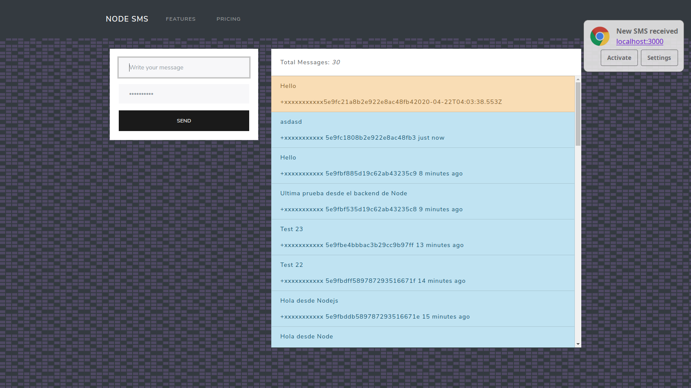

# Node SMS APP with Twilio
this is an simple example to send and recive SMS using Node, Twilio, Mongodb, and Socket.io


# Software Needed
* Nodejs
* Mongodb
* ngrok (in development). Twilio needs a domain to reach our server.

# Installation
create a file with the name `.env` in the root project with the following Environment variables:
```text
TWILIO_ACCOUNT_SID=<YOUR TWILIO ACCOUNT SID>
TWILIO_AUTH_TOKEN=<YOUR TWILIO AUTH TOKEN>
PHONE_NUMBER=<THE TRIAL PHONE NUMBER OF YOUR TWILIO PROJECT>
```
then you can run:
```shell
npm i
npm start # or npm run dev (to execute with nodemon)
```

# Environment variables
* TWILIO_ACCOUNT_SID
* TWILIO_AUTH_TOKEN
* PHONE_NUMBER
* PORT (optional)

# Useful Resources
* [Herok Patterns - Signal Pattern](https://www.heropatterns.com/)
* ngrok
* [Request body inbound Twilio SMS](https://www.twilio.com/docs/sms/twiml#twilios-request-to-your-application)
* https://www.twilio.com/docs/usage/webhooks/sms-webhooks

# Issues
* https://stackoverflow.com/questions/59753149/express-handlebars-wont-render-data
* https://handlebarsjs.com/api-reference/runtime-options.html#options-to-control-prototype-access
* https://stackoverflow.com/questions/59690923/handlebars-access-has-been-denied-to-resolve-the-property-from-because-it-is

# TODO
* add authentication
* handle multiple sockets connection
* integrate Docker 
* add tests
